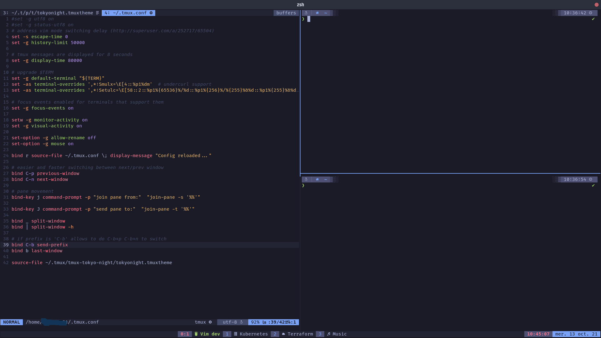

# Tmux Tokyo night theme

This is a really simple theme for tmux with the Tokyo-night palette.
There are no special characters used and only date/time and window/pane info are displayed.



## Usage
To use it, just source it in `.tmux.conf` like so:

```
source-file ~/.tmux/tmux-tokyo-night/tokyonight.tmuxtheme
```

## Credits

* [Palette for kitty](https://github.com/aerosol/tokyonight-kitty)
* [Theme for vim](https://github.com/ghifarit53/tokyonight-vim)
* [Original theme for VS code](https://github.com/enkia/tokyo-night-vscode-theme)
